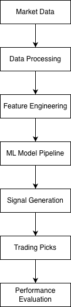

# Synapse Street: Machine Learning System for Market Signal Generation

Synapse Street is a machine learning pipeline designed to analyze financial market data and generate structured trading signals using predictive models and performance evaluation workflows.

The project explores how data pipelines, model inference, and evaluation systems can work together to produce quantitative insights from market data.

---

## Project Motivation

Financial markets generate large volumes of complex and noisy data. Extracting actionable insights requires structured data pipelines, feature engineering, and robust evaluation.

Synapse Street explores how machine learning models can be used to process financial data and produce interpretable signals that can be evaluated using backtesting metrics.

---

## System Architecture

The system follows a modular pipeline:

1. Market data ingestion
2. Feature engineering and preprocessing
3. Machine learning model inference
4. Signal generation
5. Backtesting and performance evaluation



---

## Repository Structure

```
synapse-street
│
├── src
│   └── app.py                # Main application script
│
├── notebooks
│   └── hackathon_stock.ipynb # Model experimentation
│
├── models
│   └── model_pipeline.pkl    # Trained ML pipeline
│
├── data
│   ├── equity_curve.csv
│   ├── metrics.csv
│   ├── picks.csv
│   └── today_scores.csv
│
├── docs
│   ├── SYNAPSE_STREET.pptx
│   ├── Tableau Dashboard.pdf
│   └── narrative.txt
│
└── assets
    └── architecture.png
```

---

## Technologies Used

Python
Pandas
NumPy
Scikit-learn
Machine Learning Pipelines
Tableau (data visualization)

---

## Running the Project

Install dependencies:

pip install -r requirements.txt

Run the pipeline:

python src/app.py

---

## Project Context

This project was originally developed as part of a data science hackathon exploring machine learning approaches for financial data analysis and signal generation.
